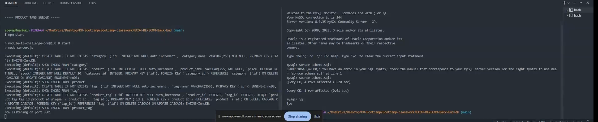
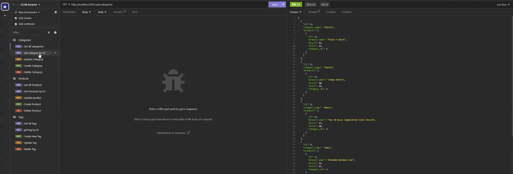

# ECOM-Back-End

https://drive.google.com/file/d/1HbXz6UNcVgF9lhRWjP6DYPAyuUlqBLHv/view\

## Description
The motive behind this project was to create a backend app that would respond to command being requested on the users end. While working on this project there was a lot of things I learned along the way. Some being the following: 
* How important it is to make sure you have everything spelt out correctly. I used the Student file as a boiler plate to help with the structure and syntax. However, there would be some items I would need to correctly transfer over using correct terms, routes, etc.  
* Sometimes its not your fault. For 2 days I struggled on why I kept having issued as to why the models folder was not being able to get located. Even after making sure all file structures were correct, after all spelling was correct  as well and nothing. After working with Jay our instructor he was able to guide me through steps to narrow down what might be the problem. After about an hour or so we tried to delete and reinstall the node_modules and after reinstalling this my code worked perfectly fine  ¯\_(ツ)_/¯

## Table of Contents
-[Descriptions](#Descriptions)
-[Installation](#Installation)
-[Usage](#Usage)
-[Credits](#Credits)
-[Tests](#Tests)
-[License](#License)
-[Questions](##Questions)

## Installation
In order to install this project you will have to clone the repository: 
    1. Create a place where you will want to store all this information 
    2. Once there open GitBash
    3. Clone this repository into the file you will have this stored in
            enter following: https://github.com/juanthtgotaway/ECOM-Back-End.git
    4. Press enter to create your local clone

## Usage
This can be used to test get, put, post, delete. Its still a work in progress however, not all commands are functioning 100%.

## Credits

## Tests
N/A
## License
MIT

## Questions
If you have any questions or concerns feel free to reach out via the following:
GitHub:[juanthtgotaway](https://github.com/juanthtgotaway)